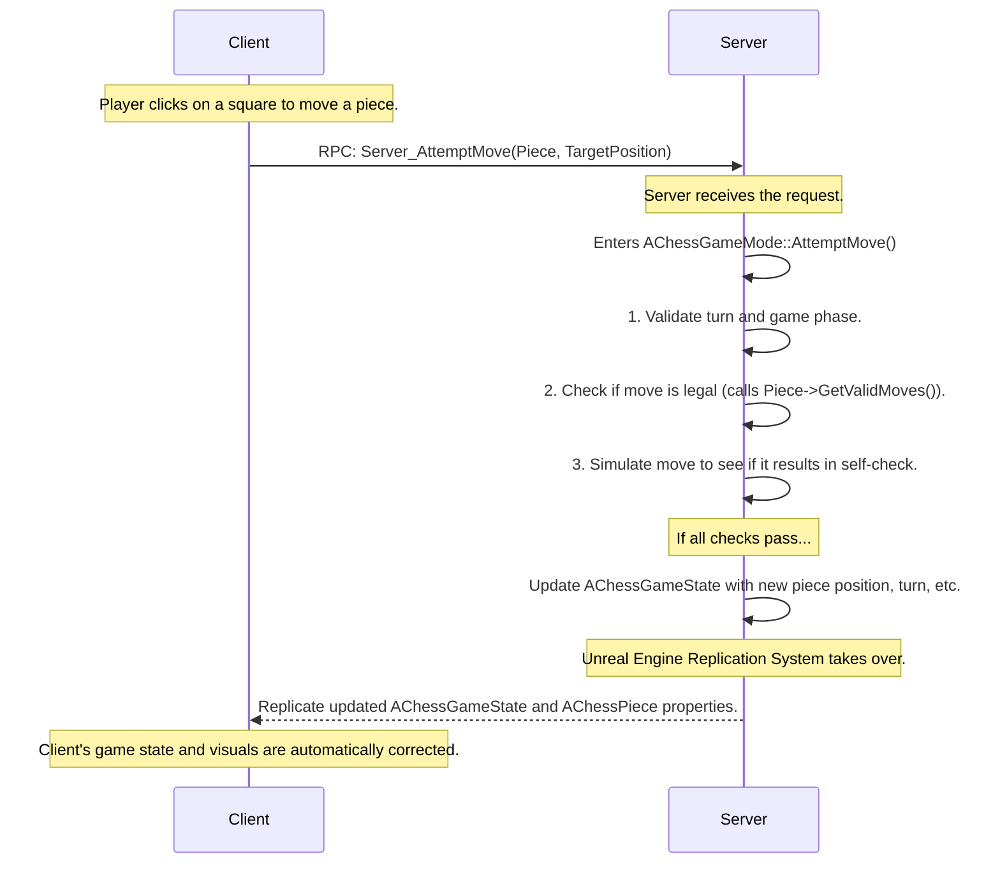
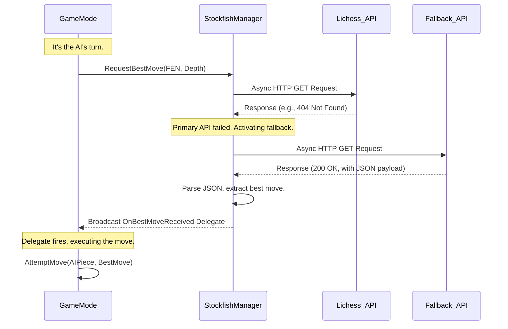

# RTX-CHESS: Advanced 3D Chess with AI and Online Multiplayer for Unreal Engine 5

<p align="center">
  <a href="https://www.unrealengine.com/"></a>
  <a href="https://isocpp.org/"></a>
  <a href="https://github.com/Defenderest/RTX_CHESS/blob/main/LICENSE"></a>
  <a href="https://github.com/Defenderest/RTX_CHESS/stargazers"></a>
</p>


**RTX-CHESS** is a high-fidelity, fully-featured 3D chess game built from the ground up in **C++** with **Unreal Engine 5**. This project is not just a visual simulation; it is a demonstration of robust software architecture, complex gameplay systems, and modern development practices. It features a formidable AI opponent powered by the Stockfish engine (via REST API) and a complete online multiplayer experience using Unreal's Online Subsystem, allowing players to compete over a local network or VPN.

---

## 📋 Table of Contents

- [🎥 **Video Showcase**](#-video-showcase)
- [✨ **Core Features**](#-core-features)
  - [Gameplay & Mechanics](#gameplay--mechanics)
  - [Intelligent AI Opponent](#intelligent-ai-opponent)
  - [Full-Featured Online Multiplayer](#full-featured-online-multiplayer)
  - [Polished User Experience & Visuals](#polished-user-experience--visuals)
- [🛠️ **Technical Stack**](#-technical-stack)
- [🏗️ **Architecture Deep Dive**](#️-architecture-deep-dive)
  - [I. Core Design Philosophy](#i-core-design-philosophy)
  - [II. System Architecture Diagram](#ii-system-architecture-diagram)
  - [III. Key Class Responsibilities](#iii-key-class-responsibilities)
  - [IV. Networking Model: Authoritative Server](#iv-networking-model-authoritative-server)
  - [V. AI Integration Flow](#v-ai-integration-flow)
- [💻 **Code Highlights**](#-code-highlights)
- [🧠 **Challenges & Solutions**](#-challenges--solutions)
- [🚀 **Getting Started**](#-getting-started)
  - [Prerequisites](#prerequisites)
  - [Build Instructions](#build-instructions)
- [🎮 **How to Play & Test**](#-how-to-play--test)
  - [Single Player (vs. AI)](#single-player-vs-ai)
  - [Multiplayer (LAN/VPN)](#multiplayer-lanvpn)
- [📈 **Future Improvements & Roadmap**](#-future-improvements--roadmap)
- [📜 **License**](#-license)

---

## 🎥 Video Showcase

A brief video demonstrating the core features of the project is highly recommended to showcase its functionality quickly.

**(Embed a link to a YouTube video showcasing the game. A good demo would include: Main Menu -> Starting a game vs AI -> Pawn Promotion -> Starting a network game -> Hosting & Joining -> A few moves in multiplayer.)**

`[}`

---

## ✨ Core Features

### Gameplay & Mechanics
The project implements the complete FIDE rules of chess, ensuring a correct and authentic gameplay experience. The logic is encapsulated in C++ for maximum performance and control.

-   **All Standard and Special Moves:** The system handles all piece movements, including complex rules often overlooked in simpler implementations.
    -   **Castling:** Validated by checking if the king/rook have moved, if the path is clear, and if the king is not in or moving through check. This logic resides in `AKingPiece::GetValidMoves`.
    -   **En Passant:** The `AChessGameState` tracks the possibility of an en passant capture on the turn immediately following a pawn's two-square advance. `APawnPiece::GetValidMoves` correctly identifies and validates this move.
    -   **Pawn Promotion:** When a pawn reaches the final rank, the game state transitions to `EGamePhase::AwaitingPromotion`. The server then sends an RPC to the controlling client, displaying a UMG widget (`UPromotionMenuWidget`) to select the new piece. The player's choice is sent back to the server to finalize the promotion.

-   **Accurate Game State Detection:** The `AChessGameMode` constantly monitors the board state after every move to detect critical game conditions.
    -   **Check:** `AChessGameState::IsPlayerInCheck` determines if a king is under attack.
    -   **Checkmate & Stalemate:** The system simulates all possible moves for the current player to differentiate between a checkmate (in check with no legal moves) and a stalemate (not in check but no legal moves).
-   **FEN String Generation:** The `AChessGameState` can generate a Forsyth-Edwards Notation (FEN) string of the current board state, essential for communication with the external Stockfish API.

### Intelligent AI Opponent
Players can challenge a highly capable AI opponent powered by the **Stockfish chess engine**. This integration was achieved without embedding the engine directly, instead relying on public cloud evaluation APIs.

-   **Asynchronous REST API Communication:** The `UStockfishManager` class uses Unreal's `HttpModule` to create and process non-blocking GET requests. This ensures the game remains responsive while waiting for the AI's move.
-   **Robust Fault Tolerance:** The manager implements a fallback strategy. It first queries the high-performance **Lichess Cloud Evaluation API**. If that API returns a 404 (indicating no pre-computed evaluation exists for the position), it seamlessly switches to the **stockfish.online API**, which computes the move on demand. This two-tier approach maximizes speed while guaranteeing a move is always found.
-   **Dynamic Move Variation:** To prevent repetitive openings, an `OpeningBook` (a `TMap` of FEN strings to move arrays) is used for the first few turns of the game. If the board position matches an entry in the book, a random valid move is chosen locally, adding a human-like variability to the AI's play and reducing API calls.
-   **Configurable Difficulty:** The player can adjust the AI's strength via a UI slider, which directly controls the `depth` parameter sent in the API request, making the AI easier or more challenging.

### Full-Featured Online Multiplayer
The project features a complete online multiplayer system, allowing two players to compete on a Local Area Network (LAN) or over the internet using a Virtual Private Network (VPN) like Radmin or Hamachi.

-   **Authoritative Server Model:** The server has the ultimate authority over the game state (`AChessGameState`). Clients send their desired moves to the server via RPCs (`Server_AttemptMove`). The server then validates the move against the game rules. If valid, the server updates its state and the changes are automatically replicated to all clients. This prevents cheating and ensures consistency.
-   **Online Subsystem (OSS):** Networking is built upon Unreal's powerful OSS, using the Null interface which is perfect for LAN/VPN play. The `UChessGameInstance` manages the entire session lifecycle:
    -   `HostSession`: Creates a listen server and registers a discoverable game session.
    -   `FindAndJoinSession`: Searches for active sessions on the network and joins them.
    -   Asynchronous operations are handled gracefully using delegates (`FOnCreateSessionComplete`, `FOnFindSessionsComplete`, etc.).
-   **Direct IP Connection:** In addition to session-based matchmaking, a simpler direct connection option is provided. The client can enter the host's IP address to travel directly to their server using `ClientTravel`.

### Polished User Experience & Visuals
Significant effort was invested in creating a polished and intuitive user experience through a combination of UI, visual effects, and audio feedback.

-   **UMG & Input Mode Management:** The entire UI, from the main menu to in-game widgets, is built with UMG. A `UWidgetSwitcher` manages the flow between different menu panels. The `AChessPlayerController` carefully manages input modes, switching between `UIOnly` for menus and `GameAndUI` for gameplay to ensure the mouse cursor and keyboard focus behave as expected.
-   **Dynamic Camera System:** A custom `AChessPlayerCameraManager` provides a smooth and controllable view of the board. It interpolates between white and black perspectives and allows the player to rotate the camera manually (by holding the right mouse button) within defined pitch limits for a comfortable viewing angle.
-   **Visual and Audio Cues:**
    -   **Move Highlighting:** Clicking on a piece sends a server RPC to request valid moves. The server responds, and the client highlights the valid destination squares.
    -   **Animated Piece Movement:** Pieces don't just snap to new positions. They smoothly interpolate, with Knights executing a graceful parabolic arc.
    -   **Physics-Based Captures:** Captured pieces aren't simply removed. They are temporarily enabled for physics simulation, given a dynamic impulse and torque, and dramatically knocked off the board before being destroyed.
    -   **Sound Design:** Specific sound effects are implemented for piece moves, captures, castling, check, and game start/end events, providing crucial auditory feedback to the player.

---

## 🛠️ Technical Stack

-   **Engine:** Unreal Engine 5.1
-   **Language:** C++ (C++17 Standard)
-   **Core UE Modules:** `Core`, `Engine`, `InputCore`
-   **Input System:** `EnhancedInput` for modern, flexible input mapping.
-   **UI:** `UMG` (Unreal Motion Graphics), `Slate`, `SlateCore`
-   **Networking:** `OnlineSubsystem` (Null Interface), `Sockets`, `Networking`
-   **API Communication:** `Http`, `Json`, `JsonUtilities`
-   **Visual Effects:** `Niagara` (for future particle effects)

---

## 🏗️ Architecture Deep Dive

### I. Core Design Philosophy
The project's architecture is built on the core principles of the Unreal Engine framework, emphasizing a clear **separation of concerns** between different classes to create a modular, scalable, and maintainable codebase.

-   **Data-Oriented Approach:** The state of the game is cleanly separated from the rules that modify it. `AChessGameState` acts as a pure data container, while `AChessGameMode` is the engine that operates on that data.
-   **Inheritance and Polymorphism:** A base `AChessPiece` class defines a common interface. Each specific piece type (e.g., `APawnPiece`, `AKnightPiece`) inherits from this base and provides its own unique implementation of the `virtual TArray<FIntPoint> GetValidMoves(...)` function. This allows the `GameMode` to treat all pieces uniformly without needing to know their specific type.
-   **Event-Driven and Asynchronous:** Systems like networking and API calls are inherently asynchronous. The project heavily utilizes Unreal's **Delegates** (`DECLARE_DYNAMIC_MULTICAST_DELEGATE`) to handle responses and events without blocking the game thread, ensuring a smooth user experience.

### II. System Architecture Diagram

This diagram illustrates the high-level relationships between the key classes in the project.

```mermaid
graph TD
    subgraph "Application Scope"
        A[UChessGameInstance]
    end

    subgraph "Level/World Scope"
        B[AChessGameMode] -- Manages Rules --> C(AChessGameState)
        B -- Spawns --> E[AChessPiece]
        D[AChessPlayerController] -- Sends RPCs --> B
        D -- Owns --> F[APlayerPawn]
        C -- Replicates to --> D
        G[AChessBoard] -- Provides World Coords --> B
        E -- Placed on --> G
    end

    subgraph "External Systems"
        H[Stockfish API]
        I[Online Subsystem]
    end

    A -- Manages --> I
    B -- Uses --> H

    style A fill:#222,stroke:#3f3,stroke-width:2px
    style B fill:#222,stroke:#f9f,stroke-width:2px
    style C fill:#222,stroke:#f9f,stroke-width:2px
    style D fill:#222,stroke:#99f,stroke-width:2px
```



### III. Key Class Responsibilities

| Class                       | Scope           | Key Responsibilities                                                                                                                                                                                                                                  |
| --------------------------- | --------------- | ----------------------------------------------------------------------------------------------------------------------------------------------------------------------------------------------------------------------------------------------------- |
| **`UChessGameInstance`**      | Game Instance   | **Session Management:** Manages the entire lifecycle of network sessions (`Host`, `Find`, `Join`). Persists across level loads.<br>**Profile Management:** Loads and saves player profiles (`UChessSaveGame`).                                              |
| **`AChessGameMode`**          | Server-Only     | **Game Rule Authority:** Enforces all chess rules.<br>**Move Validation:** The `AttemptMove` function is the central point for validating all moves.<br>**Turn Management:** Switches turns and checks for game-end conditions (checkmate, stalemate).<br>**AI Control:** Initiates AI move requests via `UStockfishManager`. |
| **`AChessGameState`**         | Replicated      | **Single Source of Truth:** Holds all replicated game state data: piece positions (`TArray<AChessPiece*>`), current turn, game phase, castling rights, en passant state, timers.<br>**FEN Generation:** Creates the FEN string for the AI. |
- **`AChessPlayerController`**
- **`AChessPlayerState`**
- **`AChessPiece`**
- **`UStockfishManager`**
| Client/Server   | **Player Input:** Captures and interprets player actions via the Enhanced Input system.<br>**UI Interaction:** Manages UMG widgets (showing menus, handling button clicks).<br>**Server Communication:** Sends player actions to the server via RPCs. |
| Replicated      | **Player Data:** Stores replicated data specific to a player, such as their name and ELO rating, which persists across pawn respawns.                                                                                                |
| Replicated      | **Piece Logic:** Base class for all pieces. Derived classes implement `GetValidMoves`. Handles its own visual representation and animation.<br>Inherited by `APawnPiece`, `AKingPiece`, etc.                                    |
| Object          | **API Abstraction Layer:** Handles all communication with the external Stockfish/Lichess APIs. Manages asynchronous HTTP requests, JSON parsing, and fallback logic.                                                              |

### IV. Networking Model: Authoritative Server

The project uses a secure and standard authoritative server model. The client never trusts its own state; it only sends requests to the server and displays the replicated result.



### V. AI Integration Flow

The AI move request is fully asynchronous to prevent the game from freezing while waiting for a web response.



---

## 💻 Code Highlights

Here are a few snippets that demonstrate key technical implementations.

**1. Server-Side RPC for moving a piece (`ChessPlayerController.h`):**
```cpp
/** [SERVER] Attempts to move a piece. Called from client, runs on server. */
UFUNCTION(Server, Reliable, WithValidation)
void Server_AttemptMove(AChessPiece* PieceToMove, const FIntPoint& TargetGridPosition);
```

**2. Asynchronous HTTP request with a Lambda callback (`StockfishManager.cpp`):**
```cpp
void UStockfishManager::RequestBestMove(const FString& FEN, int32 Depth, int32 MultiPV)
{
    // ...
    TSharedRef<IHttpRequest, ESPMode::ThreadSafe> Request = FHttpModule::Get().CreateRequest();
    Request->SetURL(Url);
    Request->SetVerb(TEXT("GET"));

    // Use a lambda to capture context for the response handler.
    Request->OnProcessRequestComplete().BindLambda([this, FEN, Depth](FHttpRequestPtr Req, FHttpResponsePtr Resp, bool bSuccess)
    {
        this->OnBestMoveResponseReceived(Req, Resp, bSuccess, FEN, Depth);
    });

    Request->ProcessRequest();
}
```

**3. Binding a UMG Widget to a C++ variable (`StartMenuWidget.h`):**
```cpp
/** The main switcher that controls which menu panel is visible. */
UPROPERTY(meta = (BindWidget))
TObjectPtr<UWidgetSwitcher> MainMenuSwitcher;
```

---

## 🧠 Challenges & Solutions

During development, several interesting challenges arose, requiring thoughtful solutions.

1.  **Challenge: Network Race Conditions & Camera Jitter.**
    -   **Problem:** When playing as Black, the camera would sometimes initially spawn with the White perspective and then jarringly snap to the Black perspective a moment later.
    -   **Cause:** The `AChessPlayerController`'s `BeginPlay` was executing and setting up the camera *before* the `PlayerColor` variable had been replicated from the server.
    -   **Solution:** The logic for setting the initial camera perspective was moved out of `BeginPlay` and into the `Client_GameStarted` RPC. This RPC is called by the `GameMode` on the server only after the player's color has been definitively assigned, guaranteeing the color data is available on the client when the camera is set up. A final check in `OnRep_PlayerColor` corrects the perspective if any timing issues still occur.

2.  **Challenge: Ensuring AI Reliability and Performance.**
    -   **Problem:** The primary Lichess API is fast because it uses a massive database of pre-analyzed positions, but it doesn't have an entry for every possible board state, especially in the mid-to-late game. This would cause the AI to fail.
    -   **Solution:** A two-tier API strategy was implemented. On a 404 response from Lichess, the system automatically dispatches a new request to a fallback API that computes the move in real-time. This provides the best of both worlds: speed when possible, and guaranteed reliability when needed.

3.  **Challenge: Fair and Cheat-Proof Networking.**
    -   **Problem:** A naive networking model might trust the client, allowing a malicious user to send invalid moves or move opponent's pieces.
    -   **Solution:** A strict authoritative server model was enforced. The client never directly changes its own game state. It only *requests* actions from the server. The server is the sole arbiter of the game rules, and all clients receive the validated, final state through replication.

---

## 🚀 Getting Started

### Prerequisites
-   **Unreal Engine 5.1** or later.
-   **Visual Studio 2022** with the **"Game Development with C++"** workload installed.
-   Git LFS for handling large files (if any are added in the future).

### Build Instructions
1.  **Clone the repository:**
    ```bash
    git clone https://github.com/Defenderest/RTX_CHESS.git
    ```
2.  **Navigate to the project directory:**
    ```bash
    cd RTX_CHESS
    ```
3.  **Generate Project Files:** Right-click the `RTX_CHESS.uproject` file and select "Generate Visual Studio project files".
4.  **Open the Solution:** Open the generated `RTX_CHESS.sln` file in Visual Studio 2022.
5.  **Build the Project:** Set the build configuration to **Development Editor** and the platform to **Win64**. Build the solution (Shortcut: `F7`).
6.  **Run the Editor:** Once the build succeeds, press `F5` or click "Start Debugging" to launch the Unreal Editor with the project loaded.
7.  **Play:** Inside the editor, click the "Play" button in the main toolbar.

---

## 🎮 How to Play & Test

### Single Player (vs. AI)
1.  Launch the game.
2.  From the main menu, click "Player vs Bot".
3.  In the bot settings menu, adjust the **Skill Level** slider and choose your desired piece color (**White**, **Random**, or **Black**).
4.  Select a **Time Control** from the dropdown menu.
5.  Click "Start Game".

### Multiplayer (LAN/VPN)
You will need to run two instances of the game (e.g., two packaged builds, or one editor instance and one packaged build).

**To Host a Game:**
1.  On the first machine, launch the game and click "Online Game".
2.  Select a **Time Control**.
3.  Click **Host Game**.
4.  The game will start, and an on-screen message will display the host's local IP address (e.g., `192.168.1.100:7777`). Provide this address to the other player.

**To Join a Game:**
1.  On the second machine, launch the game and click "Online Game".
2.  In the text box (which defaults to `127.0.0.1:7777`), enter the full IP address and port provided by the host.
3.  Click **Join Game**. You will be connected to the host's session.

---

## 📈 Future Improvements & Roadmap

While this project is a comprehensive portfolio piece, there are several avenues for future expansion:

-   [ ] **Steam Integration:** Replace the Online Subsystem Null with `OnlineSubsystemSteam` to enable internet-based matchmaking, invites, and lobbies without needing VPNs.
-   [ ] **Persistent Player Profiles:** Implement a persistent ELO rating for players that updates after each game and is saved in `UChessSaveGame`.
-   [ ] **Expanded Draw Conditions:** Add logic for more complex draw conditions, such as the 50-move rule and three-fold repetition, by tracking game history in `AChessGameState`.
-   [ ] **Save/Load Game State:** Implement functionality to save the current game state (as a FEN string and other metadata) to a save slot and resume it later.
-   [ ] **Spectator Mode:** Allow players to join a session as a spectator, able to watch the game but not interact with the pieces.
-   [ ] **Move History UI:** Add a UMG widget to display the move history for the current game in standard algebraic notation.

---

## 📜 License

This project is licensed under the **MIT License**. See the `LICENSE` file for more details. You are free to use, modify, and distribute this code for any purpose.
